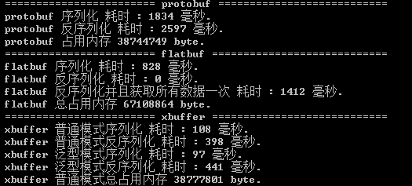

# xbuffer
一种简化版本的 flatbuffer 序列化库

## 与其他序列化库的简单对比
- protobuffer
    - 相同点:使用方便(创建结构,生成文件,仅两个调用接口)
    - 优势: `protobuf`使用了大量的反射,序列化和反序列化效率均较低
- flatbuffer
    - 相同点:序列化和反序列化效率上极高
    - 优势: `flatbuf`使用结构及其麻烦,需要自己实现部分序列化和反序列化的代码
    - 优势: `flatbufs`反序列化之后的数据结构无法在运行时中进行修改,并且每次获取任意数据均会经过大量的数据转换

- 对比测试图
    - 
    - 序列化速度是 pb的15倍, fb的7倍
    - 反序列化的速度是 pb的6倍 fb的0或3倍
    - `flatbuf`的反序列化时间有两个原因是会在具体获取数据的时候才产生耗时操作
    - 实际项目使用中相同数据输出文件大小 (protobuf:100mb flatbuf:22mb xbuffer:20mb)
    - 图中`flatbuf`内存占用过高是因为使用了 `MemoryStream`, 我在`xbuffer`中拒绝了该模式,原因是我希望有一个固定的预期内存分配
    - 在 `xbuffer` 中我提供了 普通模式和泛型模式两种接口方案,普通模式在调用中完全是显示的(所以效率是最高的),而泛型模式相比`protobuf`会把反射调用集中到只有一个顶层类型来(但是方便使用)。这样可以在不同的用途时使用不同的模式,例如底层的网络库,对业务逻辑来说开放成泛型模式会让业务层逻辑更简洁,而一些本地很大的数据例如动画文件等,可以使用普通模式来达成更高的效率。

## 后续
- 多语言版本(理论上只需要添加对应的模板文件和基础类型库即可)
- 变量注释等

## 使用示例
1. 使用类似 `flatbuf` 的idl语言写一个结构描述文件, 任意后缀名
```
class A
{
	a:[bool];
	b:[int];
	c:[float];
	d:[string];
	e:[E];
}

class E
{
	a:bool;
	b:int;
	c:float;
	d:string;
}
```
1. 将该文件拖动到 `xbuffer_parser.exe` 文件上,程序会根据 `templates` 文件夹下的所有模板文件(任意后缀),生成对应目录的代码文件
1. 将生成的代码挪到自己的项目中
1. 将运行时 `xbuffer_runtime.dll` 挪到自己的项目中
- 普通模式序列化代码
```
    byte[] buffer;;
    int offset = 0;

    ABuffer.serialize(data, buffer, ref offset);
```
这里使用一个`buffer`来存储需要序列化的数据,`offset`标记从数组的哪个位置开始存储,这样一来可以项目中共用同一个比较大的byte[]来减少频繁的内存分配.
- 普通模式反序列化代码
```
    byte[] buffer;
    int offset = 0;

    ABuffer.deserialize(buffer, ref offset);
```
这里的`buffer`可以是从任意地方读取过来的序列化数据,`offset`标记从哪里开始读取.
- 泛型模式序列化代码
```
    Serializer.serialize<T>(T value, byte[] buffer)
```
- 泛型模式反序列化代码
```
    T value = Serializer.deserialize<T>(byte[] buffer)
```